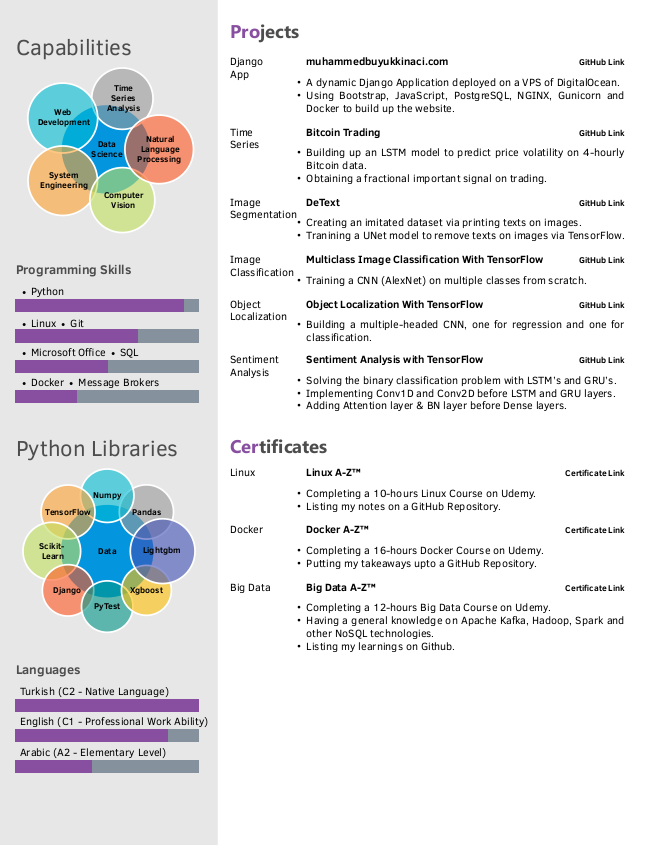

# Data-Scientist-LaTeX-Resume-with-Photo

20 Seconds CV for data scientists. 2 pages. It includes a photo in its sidebar.

# References

1) https://github.com/opensorceror/Data-Engineer-Resume-LaTeX

2) https://github.com/spagnuolocarmine/TwentySecondsCurriculumVitae-LaTex

# Pricing

This project is open-source & free. If you have no experience about coding and liked this template, I can make a resume in this type for some amount of money. If you prefer this, just leave a comment in _Issues_.

# Installation

I highly recommend using [overleaf](https://overleaf.com) to compile the code. It requires a sign up. You should choose LuaLateX to compile the code.

